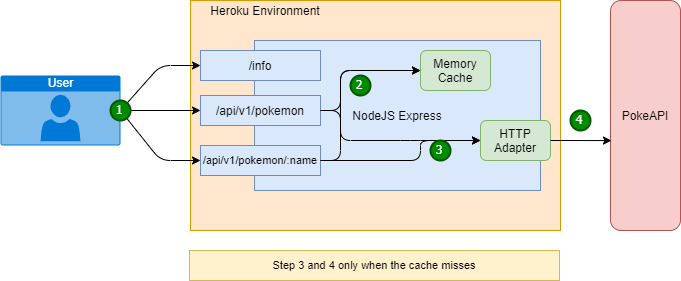

# Pokemon Backend For Frontend

The Backend For Frontend REST API. It creates a nodeJS server using expressJS and expose [the pokeAPI](https://pokeapi.co/) to the client.
In order to reduce the pokeAPI requests it stores the responses into memory cache.

## Architecture Overview

## Starting

To start the server, first of all you need to install npm dependencies:

> npm install

after the depdendencies has been installed, you must start the server:

> npm start

## Testing

The project uses jest to testing execution. In order to run the test just execute:

> npm test

Due to time limitation the current test coverage is 0%

### API Caching

The API has a memory cache in order to resource optimization. It uses [memory-cache](https://www.npmjs.com/package/memory-cache) as a helper structure
